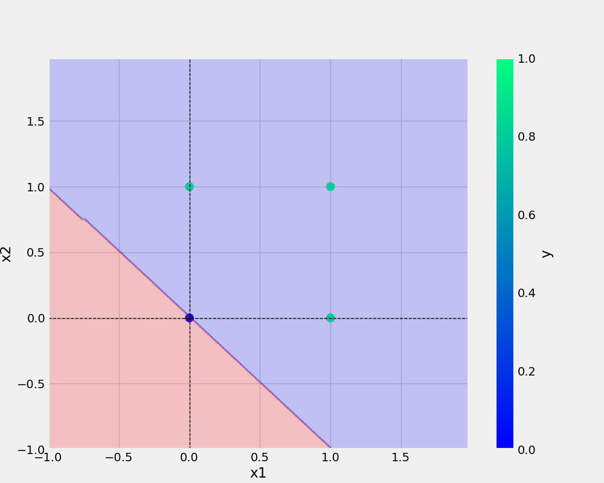
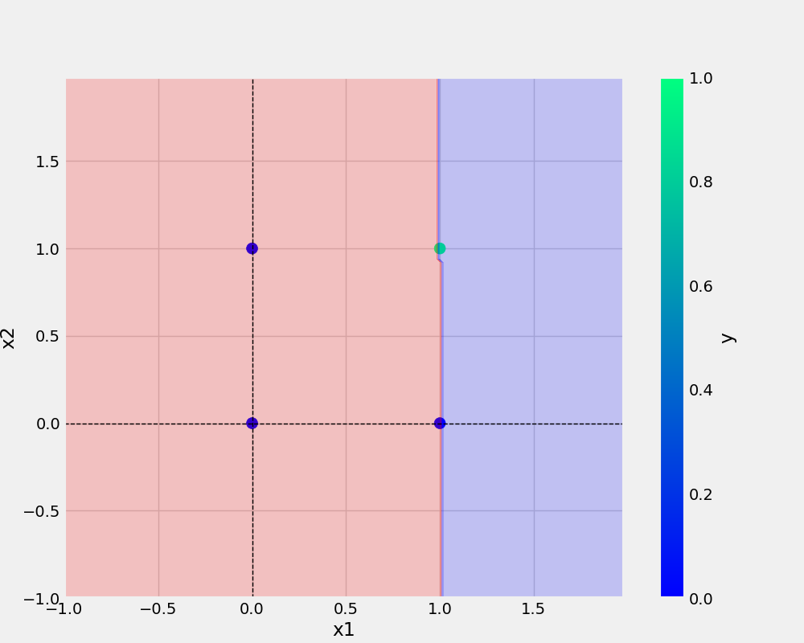

# oneNeuron
oneNeuron | Perceptron

```bash
git add . && git commit -m "" && git push origin main

```

## Add URL -
[readme.so](https://readme.so/)
<a href="https://readme.so/">readme.so HTML</a>

## Add image -




## Python code -
```python
def main(data, eta, epochs,filename, plotFileName):
    df = pd.DataFrame(data)
    logging.info(f"\n This is the actual dataFrame for and \n {df}")
    X,y = prepare_data(df)

    model = Perceptron(eta=eta, epochs=epochs)
    model.fit(X, y)

    _ = model.total_loss()

    save_model(model,filename)
    save_plot(df,plotFileName, model)

```

## Dataset
### AND dataset
x1 | x2 | y 
-|-|-
0|0|0
0|1|0
1|0|0
1|1|1

## Pointer
* Point 1
* Point 2

1. Point 3
2. Point 4

    
